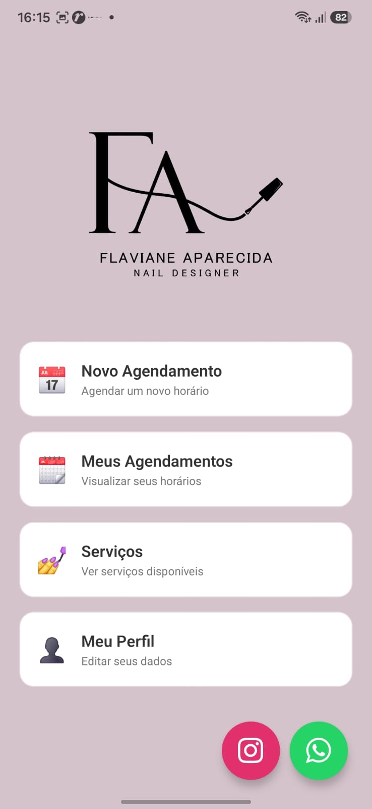
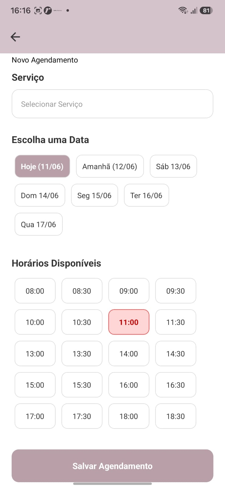
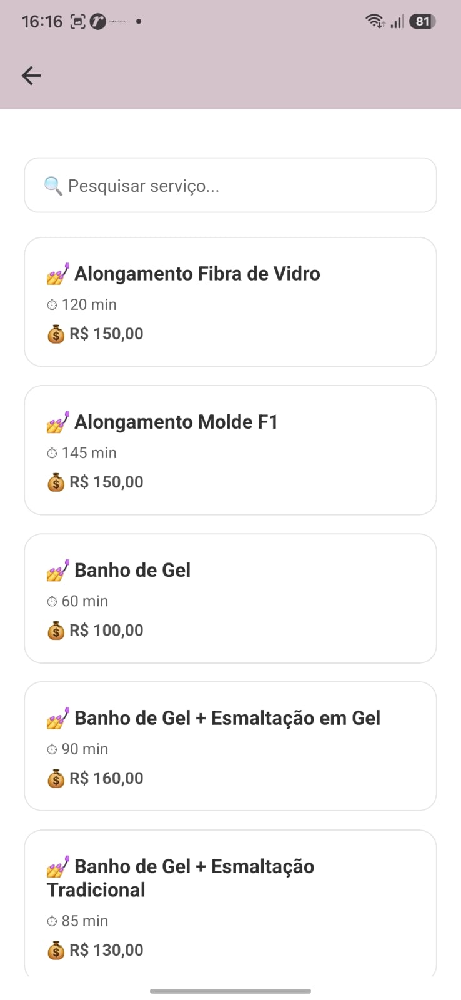
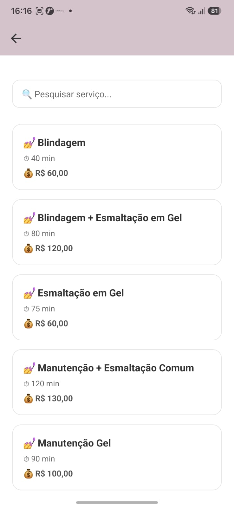
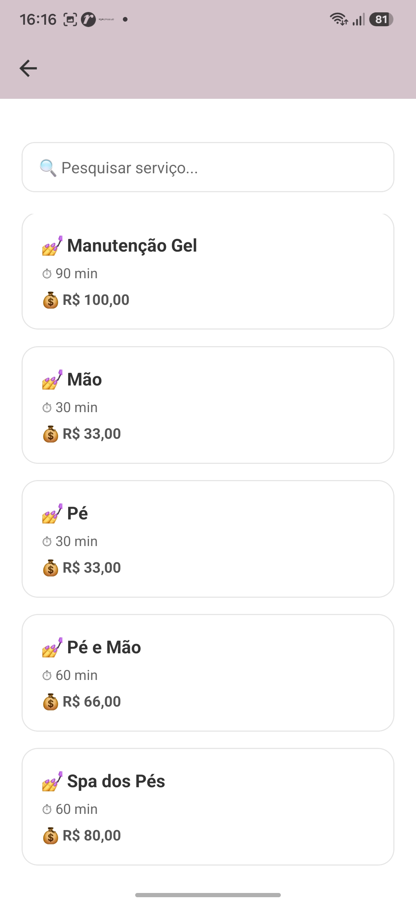
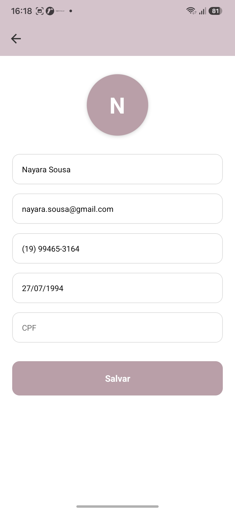
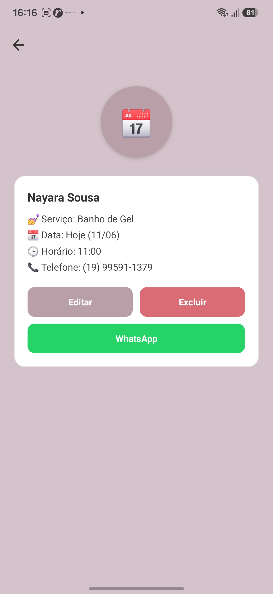

#  Agenda Flaviane Nails

Aplicativo mobile para gerenciamento de agendamentos de uma manicure, desenvolvido em **React Native**. Permite que clientes agendem horários de forma simples e rápida, e que a administradora gerencie toda a agenda em um único lugar.

---

##  Objetivo

Substituir o controle manual de horários (caderno, WhatsApp, anotações soltas) por um app organizado, evitando conflitos de horário e facilitando a comunicação entre cliente e profissional.

---

##  Funcionalidades

**Para o cliente:**
- Login e cadastro de perfil
- Edição de informações pessoais
- Visualização de serviços disponíveis
- Agendamento com seleção de data e horário
- Consulta, edição e exclusão dos próprios agendamentos
- Contato direto via WhatsApp

**Para a administradora:**
- Dashboard com visão geral dos agendamentos
- Gerenciamento completo da agenda (criar, editar, cancelar)
- Controle automático de horários já ocupados

---

##  Tecnologias Utilizadas

- React Native
- Expo
- React Navigation
- Firebase(Firestore)
- JavaScript

---

##  Estrutura do Projeto

```text
src/
├── screens/
│   ├── client/      # Telas voltadas ao cliente
│   └── admin/       # Telas voltadas à administradora
├── components/      # Componentes reutilizáveis
├── assets/          # Imagens, ícones e fontes
├── App.js
└── package.json
```

---

##  Como Executar o Projeto

### Pré-requisitos
- [Node.js](https://nodejs.org/) instalado
- App **Expo Go** instalado no celular (Android/iOS)

### Passo a passo

```bash
# Clone o repositório
git clone https://github.com/joaopaulo-99/agenda-Flaviane-Nails.git

# Instale as dependências
npm install

# Inicie o projeto
npx expo start
```

Depois de iniciar, escaneie o QR Code exibido no terminal/navegador usando o aplicativo **Expo Go**.

---

## 💾 Armazenamento de Dados

Os dados são persistidos na nuvem através do **Firebase Firestore**, incluindo:
- Informações de perfil do usuário
- Dados dos agendamentos

Isso garante que as informações fiquem sincronizadas entre dispositivos e disponíveis em tempo real para clientes e administradora.

---

## 🎓 Sobre o Projeto

Desenvolvido como projeto acadêmico para a disciplina de **Programação de dispositivos móveis para Android**.

---
## Evidências do Projeto

| | | |
|---|---|---|
|  |  |  |

| | | |
|---|---|---|
|  |  |  |

| | | |
|---|---|---|
|  |  |
